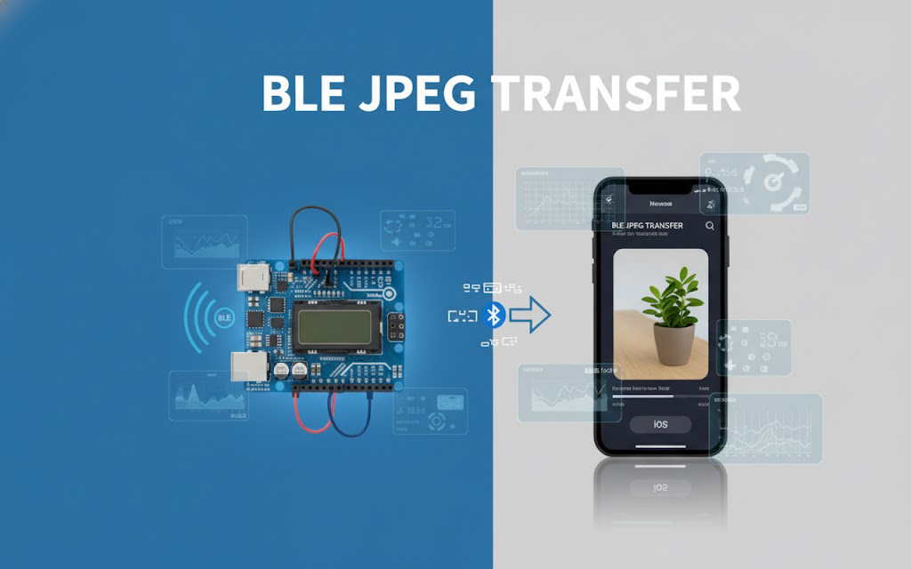

# M5Stack CoreS3 Camera → iPhone BLE 転送サンプル

M5Stack CoreS3 のカメラ映像を iPhone に BLE で転送するサンプルです。CoreS3 側は JPEG をオンデマンドでキャプチャし、GATT 特性を介して分割送信します。iOS 側は同梱の Swift ヘルパーで受信・復元して画面表示します。

この README は最新の実装に合わせて全面更新しています。

## 特長
- CoreS3 カメラのフレームを JPEG 化し、BLE Indicate で分割転送
- MTU に応じて自動でチャンクサイズを最適化
- 軽量なプロトコル（8 バイトヘッダ + JPEG 本体）
- iOS 用 Swift ヘルパー（`BLEJpegSample.swift`）を同梱、SwiftUI ですぐに確認可能
- 画面プレビューとログを CoreS3 LCD に表示

## リポジトリ構成
- `M5StackCamera-BLE-Sample.ino`: CoreS3 用スケッチ（カメラ + BLE サーバ）
- `BLE-jpg-sample/`: iOS サンプル（SwiftUI・CoreBluetooth、`BLEJpegSample.swift` を含む）

## ハードウェア / ソフトウェア要件
- デバイス: M5Stack CoreS3
- 開発環境: Arduino CLI もしくは Arduino IDE（ESP32 ボードパッケージ）
- 依存ライブラリ（Arduino ESP32 コア同梱）:
  - `M5CoreS3`, `BLEDevice`, `BLEUtils`, `BLEServer`, `BLE2902`
- iOS クライアント: iOS 15+ 推奨（`CoreBluetooth` を使用）

## 動作概要（CoreS3 側）
- 起動時にカメラと BLE を初期化、LCD にプレビューとログ領域を表示
- サービス UUID: `FE56`
- 特性:
  - Control: `beb5483e-36e1-4688-b7f5-ea07361b26a8`（Read/Write/WriteNR/Notify）
  - JPEG: `c9d1cba2-1f32-4fb0-b6bc-9b73c7d8b4e2`（Read/Indicate, `CCCD` 必須）
- プロトコル:
  - Central が JPEG 特性へ通知/インディケートを有効化（`CCCD`）
  - Control 特性に `SEND_JPEG`（文字列）を書き込み
  - Peripheral は現在のフレームを JPEG 化して送信
    - 先頭 8 バイトのヘッダ: `"JPEG"` + 4 バイト画像サイズ（BE）
    - 以降、`payload = negotiatedMTU - 3` バイトで分割し順次 Indicate

## iOS クイックスタート
1) `BLE-jpg-sample/BLE-jpg-sample/BLEJpegSample.swift` をプロジェクトに追加し、`CoreBluetooth` をリンク
2) `Info.plist` に以下を追加
   - `NSBluetoothAlwaysUsageDescription`
   - （iOS 13 未満をサポートする場合）`NSBluetoothPeripheralUsageDescription`
3) サンプルの `ContentView.swift`（同ディレクトリ）を参考に、`BLEJpegSample` を `@StateObject` として利用
4) アプリ起動後、`Start Scan` → `Ready for JPEG transfer` 状態で `Request JPEG` を押すと受信・表示

`BLEJpegSample` は以下を自動化します:
- `FE56` サービスのスキャン/接続/特性発見
- JPEG 特性の CCCD 設定（Indicate 有効化）
- `SEND_JPEG` コマンドの送出とチャンク受信・結合
- 完了後 `lastImage`（または `lastJpegData`）を更新

## 使い方（手順）
1) CoreS3 に本スケッチを書き込み、起動（LCD にプレビューとログが表示されます）
2) iOS アプリ（同梱サンプル、または自作アプリ）を起動しスキャン開始
3) 接続完了後、自動で JPEG 特性にサブスクライブ（Indicate 有効化）
4) `SEND_JPEG` を送ると 1 フレーム分の JPEG が送出され、iOS 側に表示されます
5) 必要に応じて繰り返し実行

## 設定・調整ポイント
- 画像品質: `captureFrameJPEG(gJpegBuffer, 80)` の第2引数（1–100）で調整
- チャンクサイズ: 交渉 MTU に基づき自動計算（`payload = MTU - 3`、下限 20B）
- サーバ名（アドバタイズ名）: `SERVER_NAME` 定数で変更可能（デフォルト: `M5CoreS3`）
- ログ表示: CoreS3 LCD 下部の枠内に接続や送受信の状態を表示

## トラブルシューティング
- 見つからない/接続できない:
  - 端末の Bluetooth を ON にし、距離を近づける
  - 再起動後に再スキャン、別クライアントが掴んでいないか確認
- 受信が始まらない（`CCCD not enabled`）:
  - JPEG 特性で Indicate を有効化してから `SEND_JPEG` を送信
- 途中で途切れる/サイズ不一致:
  - MTU が低い環境では時間がかかるため、リトライ
  - iOS 側はヘッダ 8B 後に指定サイズ分受信で完了（ログで確認）
- 画質/速度を上げたい:
  - 画質を下げる（品質係数を小さく）か、送信頻度を調整

## 開発メモ
- 外部依存は Arduino ESP32 コア同梱の `M5CoreS3` と BLE ライブラリを利用
- BLE サービス/特性 UUID は `M5StackCamera-BLE-Sample.ino` と `BLEJpegSample.swift` で一致
- iOS サンプルは SwiftUI（`BLE-jpg-sample` 直下）で、`ContentView.swift` から動作を確認可能

## テスト（手動確認のチェックリスト）
- 接続/切断時に CoreS3 LCD のログに反映される
- iOS 側で `Ready for JPEG transfer` → `SEND_JPEG` 実行で JPEG が表示される
- 受信完了ログに合計バイト数が表示され、ヘッダのサイズと一致する

---
補足: ボード/ポート、依存関係、コマンドは環境により異なる場合があります。問題があればシリアルログを参照し、必要に応じて UUID や品質係数、サーバ名を調整してください。

